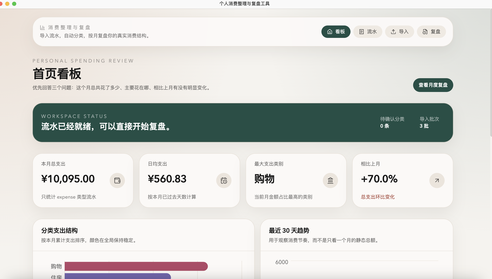
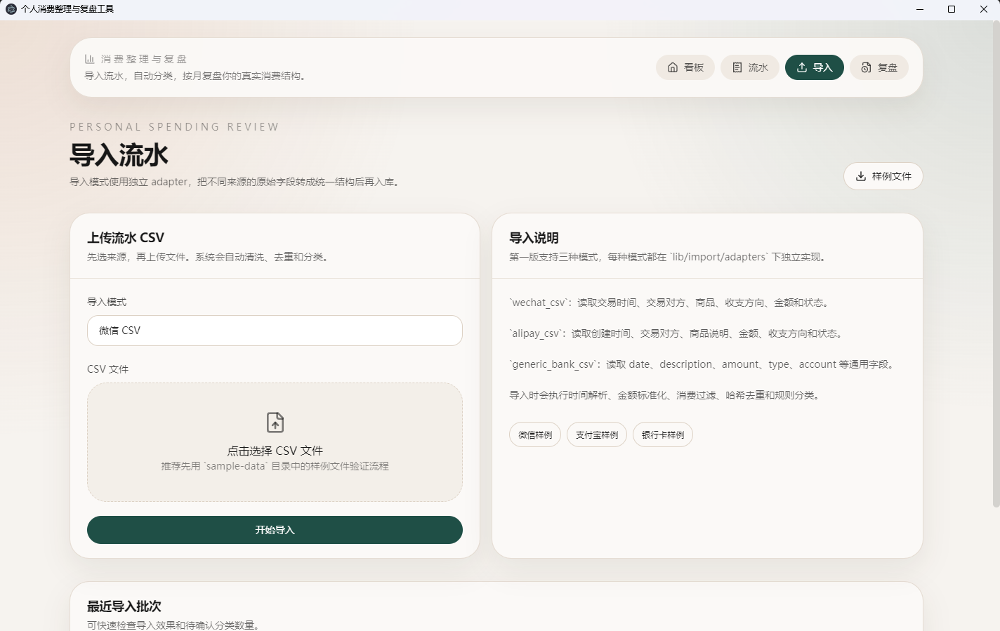
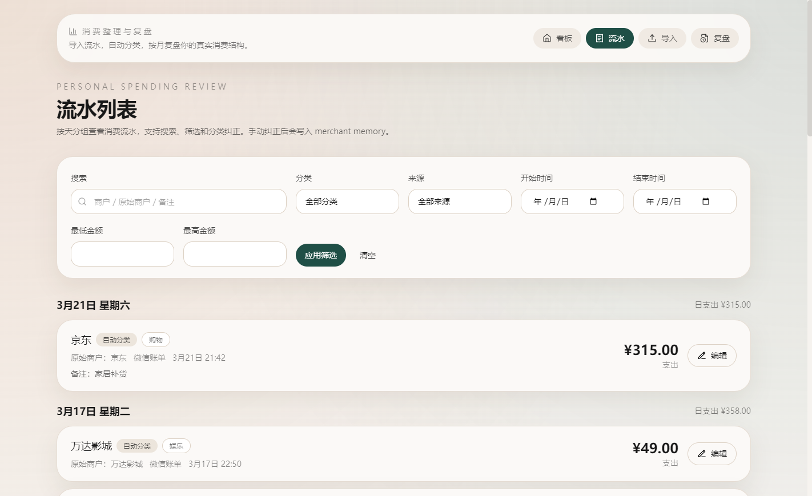
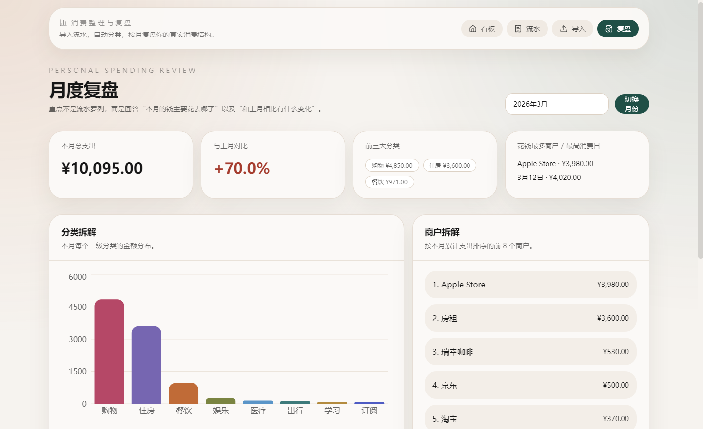

# Personal Spending Review / 个人消费整理与复盘工具

个人消费整理工具：导入流水、自动分类、可视化复盘，让每个月的消费“有结构、可回顾”。

A lightweight app that helps you clean up spending, auto categorize, and review monthly with clear visuals.

## Preview / 预览

<div align="center">
  
  
</div>
<div align="center">
  
  
</div>

## Features / 功能

- 导入：支持常见支付工具的 CSV 流水
- 自动分类：规则匹配 + “商户记忆”辅助纠错
- 可视化复盘：看板 KPI、类别结构、30 天趋势、顶部商户
- 复盘工作流：月度结构化结论（花了多少、花在哪、变化是什么）

## Quick start / 快速开始

1. Install dependencies

```bash
npm install
```

2. Run

```bash
npm run dev
```

3. 导出 CSV 流水并导入，看分类、补充备注，然后开始复盘。

## Download / 下载

v1.0.0 provides installers for macOS and Windows (see Releases).
v1.0.0 提供 macOS / Windows 安装包（见 Releases）。

## Notes / 说明

- 本项目更偏“个人工具”，默认本地存储，便于离线整理。
- 分类体系建议先从大类开始，逐步增加细分类（避免过度细分）。
